# 3D Representation Study

This is a standalone research project for comparing deterministic visible RGB-D
representations on NYUv2 and SUN RGB-D.

## At a glance

- **Datasets:** 10 NYUv2 images and 10 SUN RGB-D images.
- **Representations:** point cloud, surfel, mesh, voxel, surface TSDF,
  superpoint, graph, octree, and local descriptor.
- **Evaluation:** full-label mIoU, valid-depth mIoU, coverage, boundary F1,
  purity, construction time, element count, and viewpoint stability.
- **Scope:** deterministic visible RGB-D geometry; no neural network is trained
  in this study milestone.

> **Observation:** The study identifies which representation is useful for a
> particular quality, coverage, boundary, or efficiency goal; it does not claim
> that one representation is universally best.

## 1. Visual atlas: Cat3D and RGB-D grids

### Cat3D 3D representation atlas

<p align="center">
  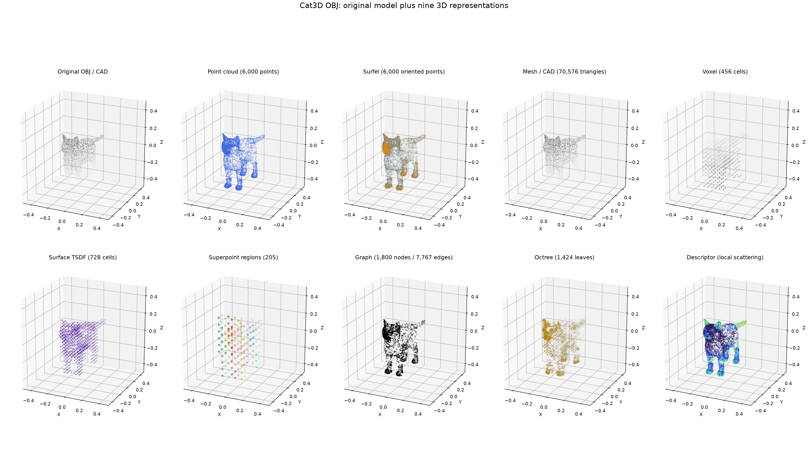
</p>

The atlas starts with the original Cat OBJ/CAD model and then shows its nine
derived 3D representations.

> **Observation:** The same object can be stored as a surface, volume,
> hierarchy, graph, or descriptor field; these are different data structures,
> not merely different visual styles.

### Dataset visual overview

The main generated figures are included here so the README starts with the
actual representation results. The 2D grids show camera-space projections;
the 3D grids show the raw geometric structures.

| Dataset | 2D representation grid | 3D representation grid |
| --- | --- | --- |
| NYUv2 | 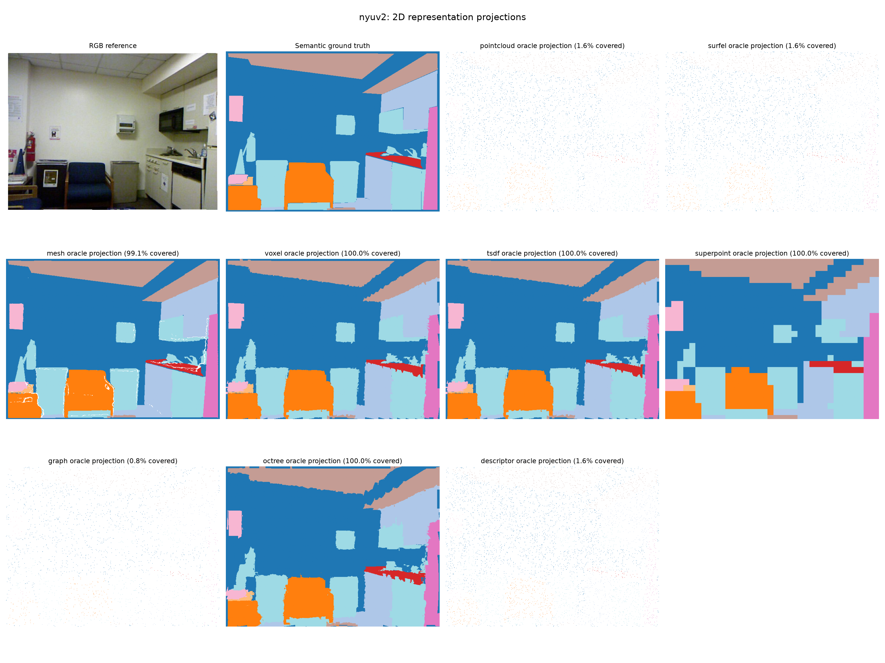 | 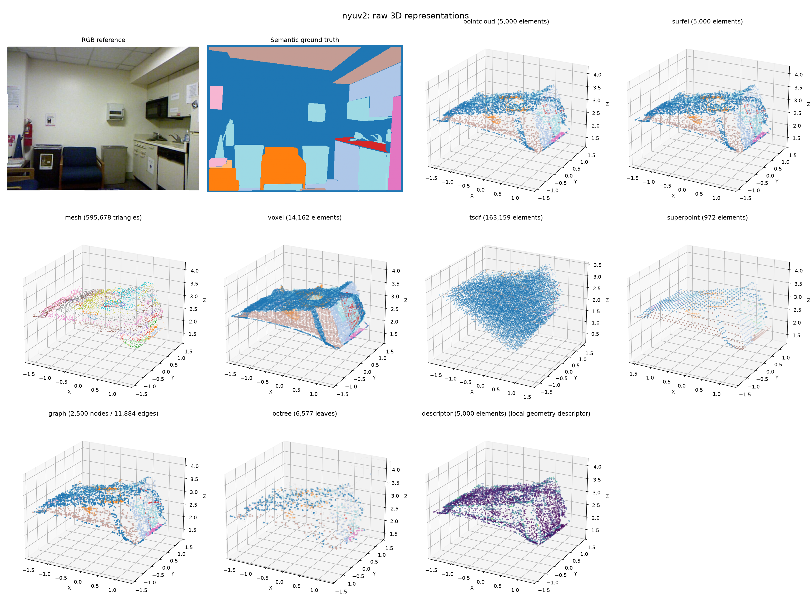 |
| SUN RGB-D | 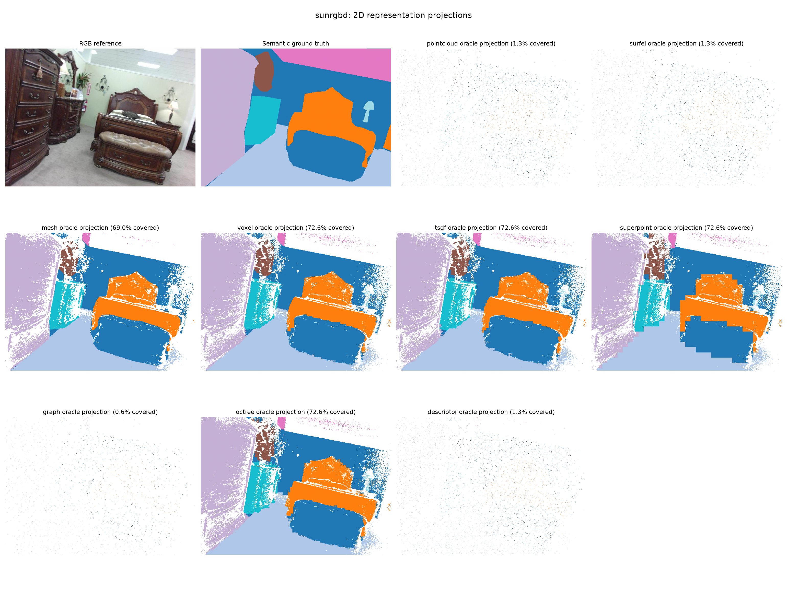 | 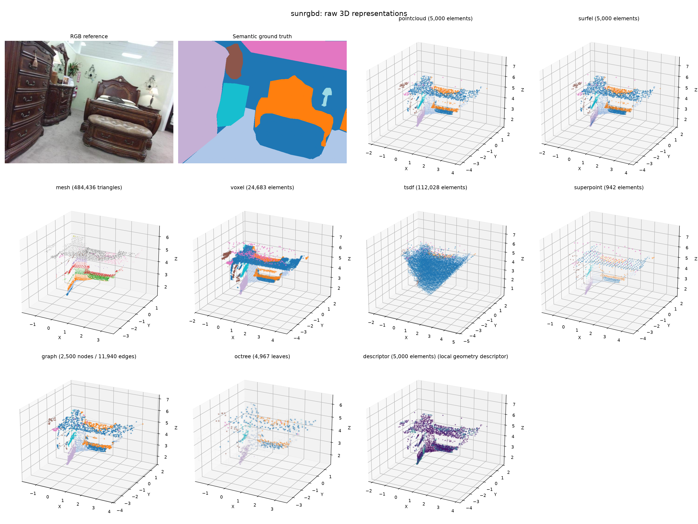 |
| Cat3D OBJ | 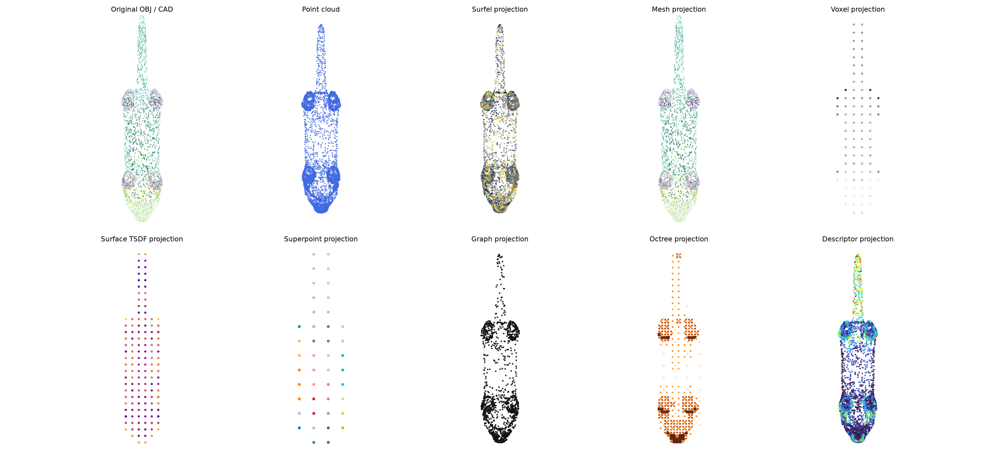 |  |

The Cat3D figure contains the original OBJ/CAD model plus nine derived 3D
representations. The separate `catDog.png` RGB scene is intentionally not
included in the output atlas.

> **Observation:** A representation can look correct in 3D but still miss many
> labeled image pixels after projection, so the 2D and 3D grids must be read
> together.

## 2. Baseline benchmark and Cat3D analysis

The pilot comparison below reports valid-depth mIoU, coverage, full-label mIoU,
and construction time for all nine representations on both RGB-D datasets.

<p align="center">
  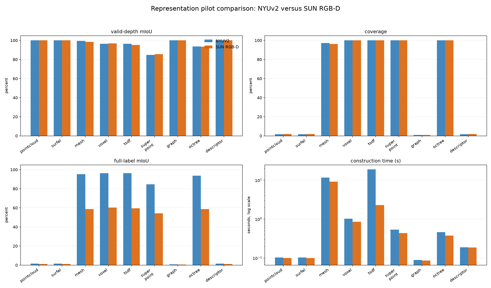
</p>

> **Observation:** Dense representations are the meaningful full-image
> comparison; sparse fixed-budget styles can have high local accuracy while
> covering only a small part of the image.

For Cat3D, the additional figures show orthographic and perspective
projections, depth and descriptor maps, surface normals, representation sizes,
and the local descriptor distribution.

| Cat3D projection analysis | Cat3D statistics |
| --- | --- |
| 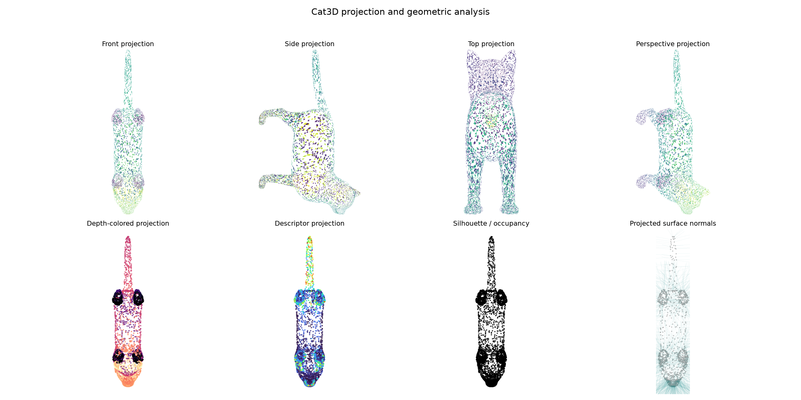 | 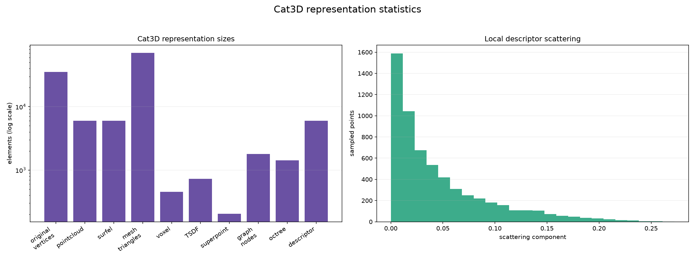 |

> **Observation:** The Cat3D atlas explains structure visually, while these
> projections and statistics expose scale and local geometric differences.

The study will compare organized point clouds, surfels, partial meshes, sparse
voxels, single-view sparse TSDFs, superpoint regions, kNN graphs, adaptive
octrees, local geometric descriptors, and deterministic multiview projections. Ground truth is used only for oracle labeling and
evaluation -- not to construct the primary geometry.

## 3. Extended comparison: quality, coverage, and stability

The extended analysis uses all nine representation styles, all ten pilot images
per dataset, and the four saved views (original, left oblique, right oblique,
and elevated). It separates dense semantic fidelity from coverage, boundary
quality, runtime, element count, image-to-image variation, and viewpoint
robustness.

<p align="center">
  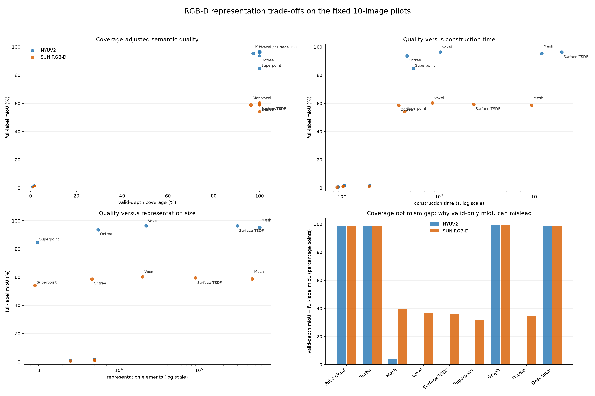
</p>

> **Observation:** Higher quality generally requires more geometry or more
> construction time; the best choice depends on the deployment objective.

<p align="center">
  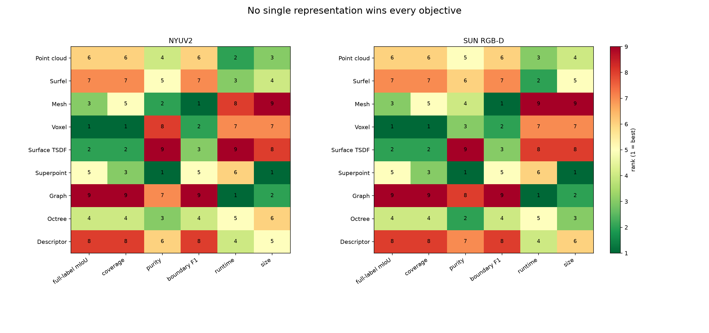
</p>

> **Observation:** No single style dominates every criterion; the preferred
> representation changes when the objective changes from quality to boundaries,
> compactness, or speed.

| Decision objective | NYUv2 pilot | SUN RGB-D pilot |
| --- | --- | --- |
| Highest full-label mIoU with full coverage | Voxel - 96.4% | Voxel - 60.3% |
| Best boundary F1 | Mesh - 71.4% | Mesh - 43.4% |
| Smallest full-coverage style | Superpoint - 972 elements | Superpoint - 904 elements |
| Fastest full-coverage style | Octree - 0.46 s/image | Octree - 0.38 s/image |

The practical first choice for dense RGB-D geometry in this pilot is therefore
the voxel representation. Choose octrees when memory and construction time are
more important, and meshes when boundary preservation is the priority. The
point cloud, surfel, graph, and descriptor rows use fixed point budgets and
cover only about 1-2% of the labeled image; their near-perfect valid-depth mIoU
is therefore not a fair dense-image comparison. Full-label mIoU and coverage
must be read together.

> **Observation:** For this pilot, voxel is the safest dense default, mesh is
> strongest for boundaries, octree is the speed/size option, and superpoint is
> the most compact full-coverage style.

<p align="center">
  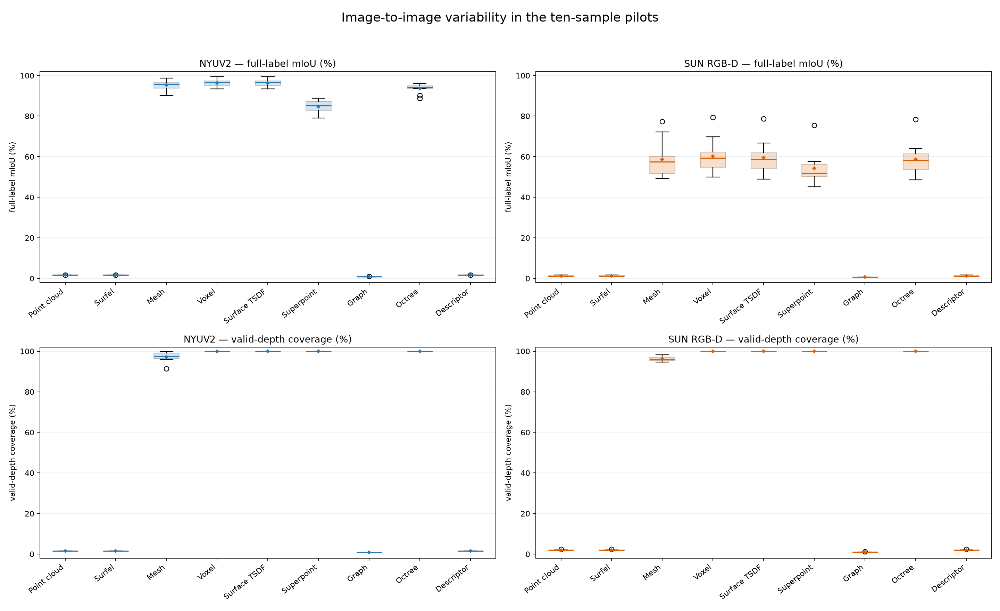
</p>

> **Observation:** Averages hide difficult frames; this plot shows which styles
> are consistently reliable and which are sensitive to scene content.

<p align="center">
  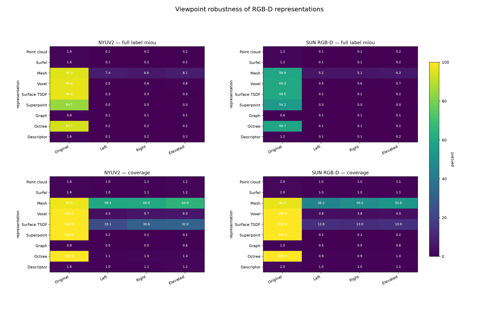
</p>

> **Observation:** A representation that changes sharply across viewpoints is
> less suitable when downstream processing must be viewpoint-stable.

<p align="center">
  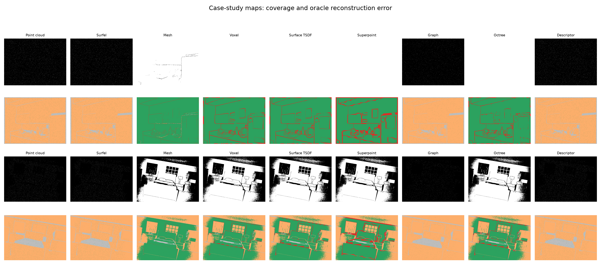
</p>

> **Observation:** The case studies connect the numbers to pixels: missing
> coverage and boundary errors are spatially distinct failure modes.

The tables behind these plots are written to
`outputs/analysis/representation_extended_metrics.csv`,
`outputs/analysis/representation_multiview_metrics.csv`, and
`outputs/analysis/representation_ranks.csv`. Recreate the complete analysis
with:

```bash
python -m repstudy.plot_extended_analysis
```

The complete written interpretation is in
[`docs/representation_findings.md`](docs/representation_findings.md). These are deterministic oracle
measurements of visible RGB-D geometry on ten images per dataset, not a claim
that one representation is universally optimal or a replacement for a trained
segmentation benchmark.

> **Observation:** This is a deterministic oracle analysis of visible geometry,
> not a trained segmentation benchmark; it identifies candidates for later
> learned-system experiments.

## 4. Small-sample follow-up experiments

The next experiments also use exactly ten NYUv2 and ten SUN RGB-D images. The
same image IDs are reused across all settings, so the comparisons are paired
and reproducible without running the full datasets.

<p align="center">
  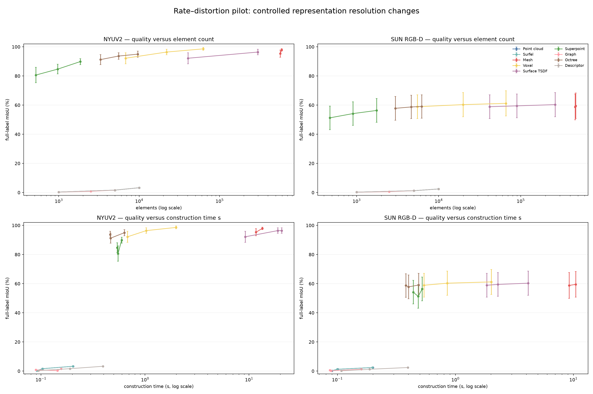
</p>

The rate-distortion pilot evaluates the baseline plus controlled coarse/fine
settings for all nine styles. For example, voxel mIoU changes from 92.1% to
96.4% to 98.6% on NYUv2 as the mean element count changes from 6.8k to 21.9k
to 62.6k. On SUN RGB-D the corresponding values are 58.9%, 60.3%, and 61.2%.
This shows that representation resolution is a real factor in the ranking.

> **Observation:** Representation resolution is an experimental factor; rankings
> should not be interpreted without reporting the geometry budget.

<p align="center">
  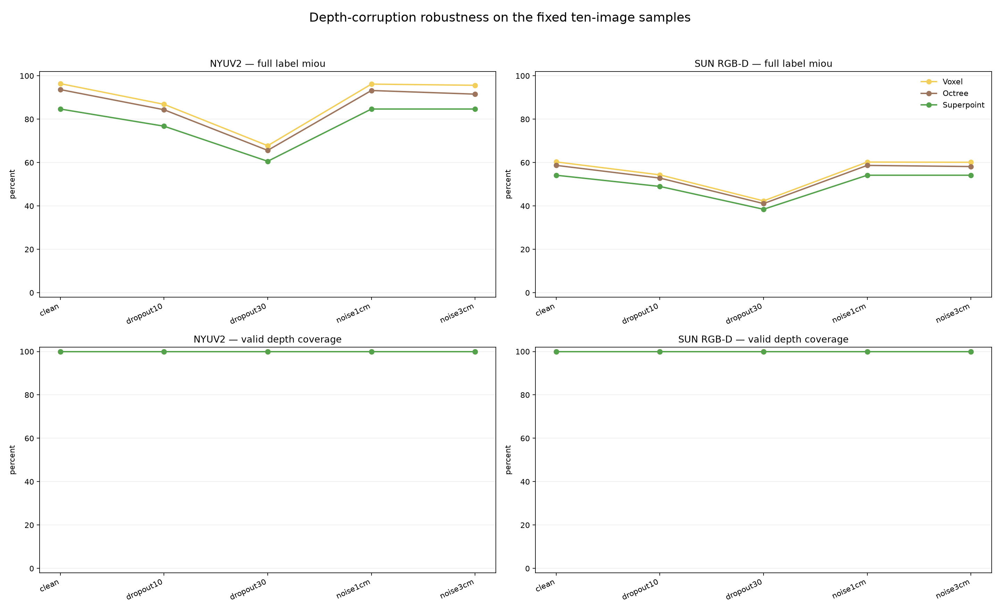
</p>

The corruption pilot applies 10% and 30% random depth dropout plus 1 cm and
3 cm Gaussian depth noise. At 30% dropout, NYUv2 full-label mIoU falls to
67.8% for voxel, 65.6% for octree, and 60.6% for superpoints. The corresponding
SUN RGB-D values are 42.3%, 41.1%, and 38.5%. Gaussian noise is less damaging
than dropout in this pilot because the representations still retain complete
valid-depth support.

> **Observation:** Missing depth is more damaging than small metric noise in
> this pilot. The 100% dense-style coverage is relative to remaining valid
> support, not evidence that dropped measurements were recovered.

<p align="center">
  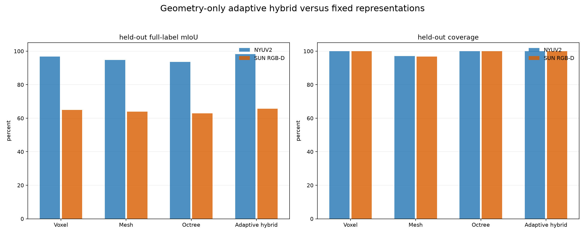
</p>

The adaptive hybrid uses geometry-only depth/RGB edge scores: mesh near
structural edges, voxel in interiors, and octree as a fallback. The edge
quantile is selected on five images and evaluated on five held-out images. Its
held-out full-label mIoU is 98.2% on NYUv2 versus 96.8% for voxel, and 65.6% on
SUN RGB-D versus 64.9% for voxel. This is promising pilot evidence, not yet a
final claim because the held-out split contains only five images per dataset.

> **Observation:** Geometry-only routing is promising, but the five-image
> held-out split is too small for a universal claim.

<p align="center">
  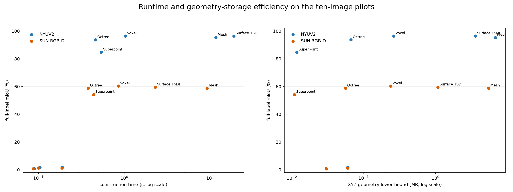
</p>

The efficiency plot reports construction time and an explicitly labeled XYZ
geometry-storage lower bound. It is a storage proxy, not a measurement of the
complete serialized representation including adjacency and attributes.

> **Observation:** This proxy is useful for comparing scale and speed, but a
> deployment decision should measure the complete serialized representation.

The experiment runner and tables are:

```bash
python -m repstudy.run_small_sample_experiments
```

```text
outputs/experiments/rate_distortion_metrics.csv
outputs/experiments/depth_corruption_metrics.csv
outputs/experiments/adaptive_hybrid_metrics.csv
outputs/experiments/representation_efficiency.csv
outputs/experiments/small_sample_experiments.md
```

The full protocol and limitations are summarized in
[`docs/small_sample_experiments.md`](docs/small_sample_experiments.md). These
experiments are a 10+10-image pilot; full-dataset evaluation is still required
before making universal claims.

> **Observation:** These are pilot experiments for comparison and debugging;
> full-dataset evaluation is required before broad conclusions.

## 5. Reproducibility and outputs

The first deterministic pipeline is implemented and smoke-tested on NYUv2:
backprojection, organized point clouds, surfels, partial meshes, sparse
voxels, single-view sparse TSDFs, superpoint regions, oracle labels,
z-buffer rendering, coverage-aware semantic metrics, boundary metrics, kNN
graphs, adaptive octrees, local descriptors, and virtual-camera projections.
The fixed pilot study uses 10 images from each
dataset, with no full-dataset training or sweep.

### Reproduce the main study

```bash
# From this repository root
python -m repstudy.validate_dataset --config configs/nyuv2_smoke.yaml
python -m repstudy.run_study --config configs/nyuv2_smoke.yaml
python -m repstudy.validate_dataset --config configs/sunrgbd_smoke.yaml
python -m repstudy.run_study --config configs/sunrgbd_smoke.yaml
```

Each configuration processes 10 images. The runner writes one directory per
sample plus `study_summary.json` and `study_summary.csv`.
Afterward, open `notebooks/02_batch_visualization_overview.ipynb` to create
one contact-sheet overview image for every sample.

> **Observation:** The fixed smoke configurations make the study reproducible
> and affordable; they are not a substitute for a full-dataset benchmark.

The two raw-geometry grids are saved as:

```text
outputs/nyuv2/nyuv2_representation_smoke/3d_representation_grid.png
outputs/sunrgbd/sunrgbd_representation_smoke/3d_representation_grid.png
```

They can also be viewed together from
`notebooks/03_raw_3d_representation_grids.ipynb`.

The matching 2D oracle-projection grids are saved as:

```text
outputs/nyuv2/nyuv2_representation_smoke/2d_representation_grid.png
outputs/sunrgbd/sunrgbd_representation_smoke/2d_representation_grid.png
```

Use `notebooks/04_2d_representation_grids.ipynb` to view them together.
The camera, left/right oblique, and elevated projections for point clouds,
graphs, octrees, and descriptors are saved as:

```text
outputs/nyuv2/nyuv2_representation_smoke/projection_grid.png
outputs/sunrgbd/sunrgbd_representation_smoke/projection_grid.png
```

Use `notebooks/05_multiview_projection_grids.ipynb` to view those projections.
Use `--max-samples 1` for a quick check, `--sample-id 00001` for a specific
frame, and `--overwrite` to recompute an existing result.

> **Observation:** The 3D, 2D, and multiview notebooks answer different
> questions: geometric structure, image coverage, and viewpoint stability.

### Cat3D asset visualization

The local `data/cat3D/` folder contains a real Cat OBJ mesh with MTL and texture
files. The output atlas contains the original OBJ/CAD model plus the same nine
representations used by the main study: point cloud, surfel, mesh, voxel,
surface TSDF, superpoint regions, graph, octree, and descriptor.

```text
outputs/cat3d/cat3d_original_plus_9_grid.png
outputs/cat3d/cat3d_2d_representation_grid.png
outputs/cat3d/cat3d_projection_analysis.png
outputs/cat3d/cat3d_statistics.png
```

The separate `data/catDog.png` RGB scene is not included in this 3D output,
because it is not a calibrated geometry source.
Use `notebooks/06_catdog_asset_grids.ipynb` to view the Cat3D atlas.

> **Observation:** Cat3D is a controlled object-level sanity check; NYUv2 and
> SUN RGB-D remain the evidence for real RGB-D scene behavior.

## 6. How to read the metrics

`valid_depth` mIoU evaluates only pixels with valid depth and representation
coverage. `full_label` mIoU counts uncovered labeled pixels as missing. Always
read mIoU together with `valid_depth_coverage` and `valid_depth_missing_rate`;
an identity-like point sample can have high covered-pixel accuracy while still
covering only a small fraction of the image.

> **Observation:** Full-label mIoU is the safest single dense-image summary,
> but coverage and boundary F1 explain why that score changes.

### Learning note and repository policy

Each representation keeps the source image pixels that contributed to each
3D element. That bookkeeping is what makes deterministic oracle labeling and
the missing-coverage measurement possible; no neural network is trained in
this study milestone.

Generated data, datasets, credentials, and checkpoints will remain outside Git.

## 7. Final recommendation

For dense RGB-D scene representation, **voxel is the recommended default** in
this pilot. It provides full image support and the highest full-label mIoU on
both datasets: 96.4% on NYUv2 and 60.3% on SUN RGB-D. Its regular spatial grid
also makes projection, batching, and downstream processing straightforward.

Choose another representation when the objective is different:

| Objective | Recommendation | Reason |
| --- | --- | --- |
| Best general dense representation | Voxel | Highest full-label mIoU with full coverage in this pilot |
| Best semantic boundaries | Mesh | Highest boundary F1 on both datasets |
| Lowest construction cost | Octree | Fastest full-coverage construction in the pilot |
| Smallest full-coverage representation | Superpoint | Fewest elements while retaining full support |
| Adaptive future direction | Hybrid mesh + voxel + octree | Promising held-out pilot result, but needs larger validation |

> **Final observation:** Use voxel as the primary RGB-D representation for the
> current study. Use mesh when boundary quality matters most, octree when speed
> or memory matters most, and superpoints when compactness matters most. The
> adaptive hybrid is a promising next experiment, not yet the final winner
> because it was evaluated on only five held-out images per dataset.
